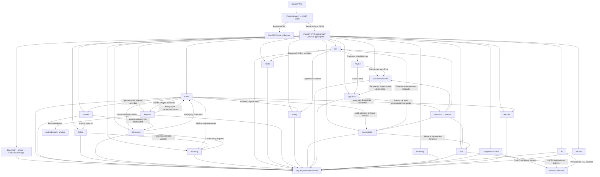

# Punto de Control - Modulos, Rutas y Flujo Inter-Sistemas

Fecha: 2026-04-03  
Workspace: `C:\Users\PC\Desktop\nuevo erp`  
Core app evaluada: `YOUR_ERP_CORE/main.py` via wrapper `main.py`

## Resumen Ejecutivo

Se verifico que el arranque desde la raiz usa el bootstrap unificado y carga la app real desde `YOUR_ERP_CORE/main.py`, por lo que rutas nuevas como `/app/expenses`, `/app/planning`, `/app/tasks`, `/app/accreditation`, `/app/signature-center` y `/app/cross-correspondence` quedan disponibles desde el mismo servidor.

Pruebas smoke ejecutadas con `venv\Scripts\python.exe` y `TestClient`:

| Ruta | Resultado | Esperado |
|---|---:|---:|
| `GET /health` | 200 | 200 |
| `GET /api-info` | 200 | 200 |
| `GET /app/login` | 200 | 200 |
| `GET /app/expenses` | 200 | 200 |
| `GET /app/planning` | 200 | 200 |
| `GET /app/tasks` | 200 | 200 |
| `GET /expenses/dashboard` sin token | 401 | 401 |
| `GET /planning/dashboard` sin token | 401 | 401 |
| `GET /tasks/dashboard` sin token | 401 | 401 |

## Modulos Nuevos / Relevantes y Rutas

| Modulo | Dependencias declaradas | Frontend | Rutas backend principales |
|---|---|---|---|
| `expenses` | `base`, `crm`, `billing` | `/app/expenses` | `/expenses/dashboard`, `/expenses/reference-data`, `/expenses/records`, `/expenses/records/{id}`, `/expenses/backups`, `/expenses/backups/{id}` |
| `planning` | `base`, `crm`, `billing`, `expenses` | `/app/planning` | `/planning/reference-data`, `/planning/dashboard`, `/planning/budgets`, `/planning/budgets/{id}`, `/planning/budgets/{id}/lines`, `/planning/lines/{id}` |
| `tasks` | `base`, `hr` | `/app/tasks` | `/tasks/dashboard`, `/tasks/reference-data`, `/tasks/activities`, `/tasks/activities/{id}` |
| `accreditation` | `base`, `crm`, `hr` | `/app/accreditation`, `/accreditation/{service_order_id}` | `/api/accreditation/service-orders`, `/api/accreditation/service-orders/{service_order_id}/crew`, `/api/accreditation/service-orders/{service_order_id}/checks`, `/accreditation/service-orders` |
| `crm` + `quotes` + `billing` | `base`, `crm`, `quotes` | `/app/crm`, `/app/quotes`, `/app/billing` | `/crm/*`, `/quotes/*`, `/billing/*` |
| `hr` + `job_profiles` + `attendance` + `payroll` | `base`, `safety`, `document_center`, `signature` | `/app/hr`, `/app/job-profiles`, `/app/attendance`, `/app/payroll` | `/hr/*`, `/job-profiles/*`, `/attendance/*`, `/payroll/*` |
| `reports` + `safety` | `base`, `crm`, `hr` | `/app/reports/{report_id}`, `/app/safety`, `/app/safety/admin`, `/app/safety/locations` | `/reports/*`, `/reports/checkpoints/{cp_id}/photo`, `/safety/*`, `/areas/*`, `/sectors/*` |
| `document_center` + `signature` + `mail` + `google_workspace` + `ai` | `base`, `signature` | `/app/document-center`, `/app/signature-center`, `/app/google-workspace`, `/app/ai` | `/document-center/*`, `/signature/*`, `/mail/*`, `/google-workspace/*`, `/ai/*` |

## Verificacion Frontend -> Backend

Chequeo automatizado:

- Catalogo combinado de rutas FastAPI + rutas registradas por modulos: 366 patrones normalizados.
- Llamadas JS detectadas (`API.get/post/put/del` y `fetch` con path absoluto): 354.
- Desacoples estaticos pendientes tras normalizacion: 12.

Lectura de esos 12 casos:

- `accreditation.js -> /hr/accreditation/matrix${customerQueryString()}` apunta a un path valido (`/hr/accreditation/matrix`), pero el scanner lo marca por concatenacion dinamica.
- `quote_form.js -> /crm/documents/Lead/` parece prefijo dinamico para `/crm/documents/{model_name}/{record_id}`; requiere validacion manual, pero no necesariamente es error.
- `safety_folder_detail.js -> /safety/documents/`, `/safety/irl-records/`, `/safety/ppe-deliveries/`, `/safety/talks/`, `/safety/checklists/` son prefijos concatenados con IDs en runtime; el scanner estatico los ve incompletos.

Conclusion de rutas: las rutas smoke de modulos nuevos responden correctamente y no se detecto una ruta rota confirmada en runtime dentro del set validado. Los "faltantes" que quedan son principalmente artefactos de concatenacion dinamica en JS y conviene revisarlos caso a caso si se quiere cerrar el backlog a 0.

## Hallazgo Tecnico Importante

Se detecto un problema de arquitectura en `YOUR_ERP_CORE/core/YOUR_ERP_core_framework.py`: `BaseModule` define `_models`, `_routes`, `_views`, `_permissions` y `_hooks` como atributos de clase mutables, por lo que todas las instancias de modulos comparten el mismo diccionario.

Evidencia:

- `id(module.get_routes())` es exactamente el mismo para `base`, `signature`, `crm`, `expenses`, `planning`, `tasks`, etc.
- Cada modulo reporta `count=388` rutas, aunque estaticamente `expenses` solo registra 10 rutas, `planning` 10 y `tasks` 7.

Impacto:

- La atribucion "ruta pertenece a modulo X" queda distorsionada en introspeccion dinamica.
- El `dispatch_request()` recorre la misma tabla de rutas repetida una vez por modulo cargado, aumentando trabajo y ruido de depuracion.
- Si algun modulo registra una ruta con la misma clave `METHOD:/path` que otro, puede sobreescribirla de forma global.

Recomendacion tecnica:

- Inicializar `_models`, `_routes`, `_views`, `_permissions` y `_hooks` como atributos de instancia dentro de `BaseModule.__init__`.
- Re-ejecutar smoke tests y el inventario dinamico de rutas para confirmar que cada modulo expone solo sus rutas propias.

## Flujograma Inter-Sistemas

## Siguiente Paso Sugerido

Si quieres, en el siguiente pase puedo corregir el bug de `_routes` compartido y dejar el inventario dinamico por modulo limpio, mas una tabla de endpoints exportada a `docs/` con conteo exacto por subsistema.
